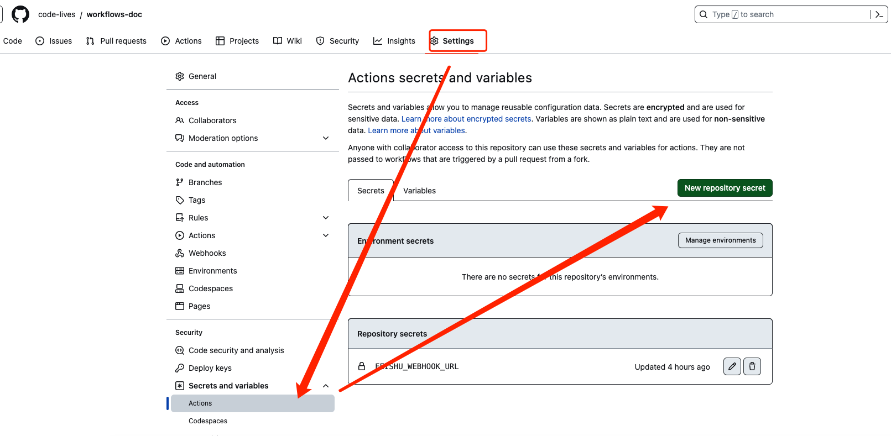
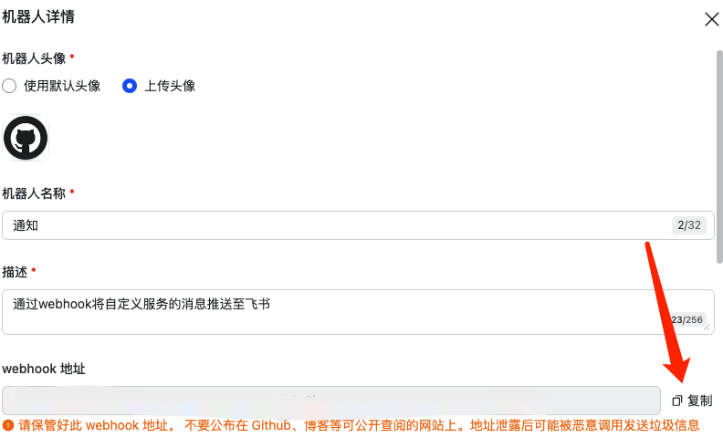
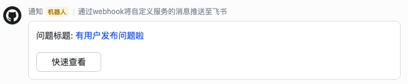

# Workflows 如何使用

> 触发的分支全部是 release 分支,用哪个自己改。不然我这 push 一次运行一堆 action 😄

> 需要创建.github/workflows 文件夹存放

> 关于 uses 使用文档[查看](https://github.com/marketplace?type=actions)

# yml 文件中 secrets 变量，类似于模版赋值。

> 在当前项目的设置【Secrets and variables】->【Actions】->【New repository secret】创建



# 开始介绍不同文件的作用

## docker-build.yml 镜像打包上传镜像库

> 根据 Dockerfile 进行打包，生成镜像最后上传到镜像库。这里使用的阿里云镜像库。

> Dockerfile 就在根目录存放即可。如果存在其他目录如 docker 文件夹

```
docker build -t ${{ secrets.IMG_ADDRESS }}:$GITHUB_RUN_NUMBER -f release/Dockerfile .
```

## docker-build-new.yml 镜像打包上传镜像库

> 对比 docker-build.yml。这个案例的 docker 登录、镜像打包、上传。使用了更多的 uses 动作

## docker-deploy-linux.yml 打包部署到 linux

> 打包成镜像，上传镜像库，登录 Linux，拉取镜像，部署

## Github issues 有问题飞书通知

> Github 有问题创建和关闭 or 评论 的话就，就飞书通知

1、飞书创建群聊

2、加入自定义机器人

3、把 webhook 复制到自己的 secrets 变量 FEISHU_WEBHOOK_URL

### 飞书机器人



### 接收效果



# 相关文档链接

### issues types 有哪些类型 比如 opened、edited、deleted、closed 等状态

[issues.types 的事件文档查看](https://docs.github.com/en/actions/using-workflows/events-that-trigger-workflows#issues)

### issues 有哪些类型的字段可以使用传递

[github.event.issue.html_url 变量文档查看](https://docs.github.com/en/rest/issues/issues?apiVersion=2022-11-28)
